# Z-WBE Bottleneck Lab

> **Change the assumptions. See what breaks first.**

[](https://cloud.google.com)
[](https://colab.research.google.com/github/zrt219/Z-WBE-Bottleneck-Lab/blob/main/notebooks/Z_WBE_GPU_LAB.ipynb)
[](https://cloud.google.com/run)
[](https://openrouter.ai/models/nvidia/nemotron-3-super-120b-a12b:free)
[](https://rapids.ai)
[](https://z-wbe-bottleneck-lab.vercel.app)
[](https://vitest.dev)
[](https://www.typescriptlang.org)
[](LICENSE)

**Built for the Google Cloud × NVIDIA GTC Berlin 2026 Golden Ticket Challenge**  
GitHub Repository: [https://github.com/zrt219/Z-WBE-Bottleneck-Lab](https://github.com/zrt219/Z-WBE-Bottleneck-Lab)  
Contest Hashtag: **`#NVIDIAGTC`**

---

## 🏛️ Google Cloud × NVIDIA Developer Challenge 2026: Project Demonstrator

**Z-WBE Bottleneck Lab** was built for the **Google Cloud × NVIDIA GTC Berlin 2026 Golden Ticket Challenge**. Built on strict epistemic separation, the public interactive demonstrator is deployed with high-speed global edge delivery on **Vercel**, backed by a production-ready containerized microservice architected for **Google Cloud Run**, and leverages open foundation models (**NVIDIA Nemotron 3 Super 120B** via OpenRouter) alongside **NVIDIA RAPIDS (`cudf.pandas`)** in Google Cloud Colab Enterprise to evaluate multi-dimensional scaling bottlenecks in Whole Brain Emulation.

---

## 🏆 Verified Credentials & Completed Learning Pathways

To develop Z-WBE Bottleneck Lab, the developer completed the official **Google Cloud & NVIDIA Learning Pathways**, earning verified credentials on **September 7, 2026**:

* **Google Developers Public Profile**: [developers.google.com/profile/u/110918189625880989910](https://developers.google.com/profile/u/110918189625880989910) (Developer ID: `110918189625880989910`)
* **Verification Status**: 3 Official Digital Badges + 4 Learning Pathways Completed

<div align="center">
  
  <p><em>Verified Google Cloud & NVIDIA Developer Community Badges (Earned Sep 7, 2026)</em></p>
</div>

### How Each Pathway Directly Enabled Z-WBE Bottleneck Lab

| Learning Pathway & Public Badge Link | Verification Status | Architectural Contribution to Z-WBE Bottleneck Lab |
| :--- | :---: | :--- |
| **1. [Deploy Faster Generative AI Models with NVIDIA NIM on GKE](https://developers.google.com/profile/badges/playlists/nvidia-deploy-with-gen-ai?u=110918189625880989910)**<br>[🔗 Course Pathway](https://developers.google.com/learn/pathways/deploy-faster-gen-ai-models-nvidia-gke) | ✅ Verified Badge<br>(Sep 7, 2026) | **Containerized Microservice & Inference Gateway**: Informed the high-throughput serverless microservice design for Google Cloud Run. Guided the strict JSON schema serialization, low-latency client caching, and resilient circuit-breaker fallbacks when requesting generative reasoning from NVIDIA Nemotron. |
| **2. [Speed Up Data Analytics on GPUs](https://developers.google.com/profile/badges/playlists/speed-up-data-analytics-GPUs?u=110918189625880989910)**<br>[🔗 Course Pathway](https://developers.google.com/learn/pathways/speed-up-data-analytics-GPUs) | ✅ Verified Badge<br>(Sep 7, 2026) | **100,000-Scenario Monte Carlo Exploration Map**: Applied GPU-accelerated dataframe processing with NVIDIA RAPIDS `cudf.pandas` in Google Cloud Colab Enterprise, enabling zero-code GPU parallelism across a 100,000-scenario multi-dimensional parameter space. |
| **3. [Accelerated Machine Learning with Google Cloud and NVIDIA](https://developers.google.com/profile/badges/playlists/accelerated-machine-learning-with-google-cloud-and-nvidia?u=110918189625880989910)**<br>[🔗 Course Pathway](https://developers.google.com/learn/pathways/accelerated-machine-learning-with-google-cloud-and-nvidia) | ✅ Verified Badge<br>(Sep 7, 2026) | **8-Dimensional Hardware Bottleneck Matrix**: Provided the systems-level engineering foundation to model tensor compute scaling (PFLOPS), High-Bandwidth Memory (HBM3e) bus bandwidth saturation, NVLink cluster fabric communication, and megawatt data-center power limits. |
| **4. [Intro to Inference: How to Run AI Models on a GPU](https://developers.google.com/learn/pathways/ai-models-on-gpu-intro)** | ✅ Completed<br>(Verified) | **Latency Budgeting & Token Calibration**: Taught KV-cache sizing, memory-bandwidth-bound vs. compute-bound inference phases, and temperature control. Enabled seamless zero-token-waste integration with `nvidia/nemotron-3-super-120b-a12b:free` on OpenRouter. |

---

## ⚖️ Official Judging Criteria Alignment Matrix

Entries are evaluated by a joint Google Cloud & NVIDIA judging panel on four equally weighted criteria (1–10 scale):

| Criterion | Evaluation Dimension | How Z-WBE Bottleneck Lab Fulfills It (10/10 Focus) |
| :--- | :--- | :--- |
| **(a) Technical Innovation** | Novelty, biophysical scaling, and real-time Amdahl's Law modeling | First public scientific tool to connect all 8 dimensions of Whole Brain Emulation (imaging, segmentation, PFLOPS, memory bandwidth, NVLink interconnect, power, proofreading, budget) into 12 coupled analytical equations executing in **&lt; 1 ms** locally. Eliminates speculative timelines with deterministic sensitivity curves. |
| **(b) Effective Use of NVIDIA & Google Cloud** | Ecosystem synergy and full-stack integration | End-to-end integration: **Google Cloud Colab Enterprise** hosts the parameter sweeps; **NVIDIA RAPIDS cuDF** accelerates 100,000-scenario Monte Carlo simulations; **Google Cloud Run** containerization configurations are provided for serverless microservice deployment; and **NVIDIA Nemotron 3 Super 120B** (`nvidia/nemotron-3-super-120b-a12b:free` via OpenRouter) delivers grounded causal interpretation. |
| **(c) Potential Impact & Usefulness** | Value to developers, researchers, and scientific community | De-silos neuroscience, electron microscopy, and HPC engineering. When researchers ask *"What happens if imaging becomes 100x faster?"*, the lab proves that the dominant bottleneck immediately jumps to memory bandwidth and cold storage, preventing millions in misallocated capital grants. |
| **(d) Quality of Documentation & Presentation** | Code cleanliness, tests, accessibility, and documentation | Complete mathematical specification for all 12 equations; **84 passing automated Vitest unit tests** across 10 suites; strict TypeScript monorepo; WCAG 2.1 AAA accessibility mode; 1-click interactive demo; scenario permalink state synchronization; comprehensive visual walkthroughs, animated GIFs, and Colab runtime verification proofs. |

---

## 🤖 Open Model Integration: NVIDIA Nemotron 3 Super 120B (Free on OpenRouter)

The challenge invites developers to build with open models like **Nemotron**, **Cosmos**, or **Gemma**. Z-WBE Bottleneck Lab harnesses:
* **Model ID**: `nvidia/nemotron-3-super-120b-a12b:free`
* **Provider Gateway**: OpenRouter
* **Cost**: 100% Free Tier (`:free`)
* **Architecture**: 120-Billion Parameter Hybrid Mamba-Transformer Architecture (delivering linear attention efficiency and long-context synthesis).

### The Strict Epistemic Grounding Contract (Deterministic Numerical Boundary)
Language models frequently hallucinate when asked open-ended scientific or economic questions. Z-WBE Bottleneck Lab enforces a strict architectural contract:
1. **Deterministic Calculation**: The TypeScript shared engine (`@z-wbe/shared`) computes every physical number, voxel count, FLOPS rating, memory bandwidth, and dollar cost deterministically.
2. **Strict Grounding Payload**: When users click `[ EXPLAIN WITH NEMOTRON ]`, the backend transmits only the pre-computed metrics inside a structured JSON schema (`NemotronInputSchema`).
3. **Structured Causal Synthesis**: Nemotron's system prompt forbids inventing numbers; it is tasked strictly with explaining *why* the identified bottleneck dominates and *where* it will shift next under Amdahl's Law.
4. **Dual Interpretation Modes**:
   - **🔬 Expert Mode**: Deep biophysical and systems-architecture synthesis referencing tensor pipelines, HBM3e saturation, and optical throughput limits.
   - **🎓 ELI5 Mode**: High-level, accessible intuition utilizing everyday analogies (e.g. comparing microscope imaging queues to city traffic jams and memory bottlenecks to congested highway offramps).
5. **Resilient Circuit Breaker**: If OpenRouter encounters HTTP 429 rate limiting or network downtime, a deterministic analytical explanation is generated client-side from the code's sensitivity derivatives—ensuring uninterrupted scientific operation.

---

## Table of Contents
1. [Research Premise & Core Question](#1-research-premise--core-question)
2. [Why This Laboratory Exists: Amdahl's Law for Neurotechnology](#2-why-this-laboratory-exists-amdahls-law-for-neurotechnology)
3. [Live Demonstrator & The Hero Scenario](#3-live-demonstrator--the-hero-scenario)
4. [Visual Walkthrough & Interactive Demo Recordings](#4-visual-walkthrough--interactive-demo-recordings)
5. [Application High-Resolution Screenshot Gallery (1920×1080)](#5-application-high-resolution-screenshot-gallery-19201080)
6. [Dual-Path System Architecture](#6-dual-path-system-architecture)
7. [The Epistemic Grounding Contract](#7-the-epistemic-grounding-contract)
8. [Comprehensive Mathematical Specification (All 12 Equations)](#8-comprehensive-mathematical-specification-all-12-equations)
9. [The 8-Dimensional Bottleneck Matrix](#9-the-8-dimensional-bottleneck-matrix)
10. [Biological Presets & Physical Baselines](#10-biological-presets--physical-baselines)
11. [NVIDIA Acceleration Stack & Tesla T4 Colab Benchmarks](#11-nvidia-acceleration-stack--tesla-t4-colab-benchmarks)
12. [Google Cloud Infrastructure](#12-google-cloud-infrastructure)
13. [Vercel Fullstack Deployment Guide](#13-vercel-fullstack-deployment-guide)
14. [Local Installation & Development](#14-local-installation--development)
15. [Visual Assets & Campaign Media Showcase (Contest Showcase Gallery)](#15-visual-assets--campaign-media-showcase-contest-showcase-gallery)
16. [Verification Test Suite (84/84 Passing)](#16-verification-test-suite-8484-passing)
17. [Scientific Limitations & Epistemic Boundaries](#17-scientific-limitations--epistemic-boundaries)
18. [Submission Metadata & Verified Credentials](#18-submission-metadata--verified-credentials)
19. [License & Citation](#19-license--citation)

---

## 1. Research Premise & Core Question

Under a specified set of biological, imaging, reconstruction, computing, memory, interconnect, power, and economic assumptions, **which technical constraint becomes the dominant bottleneck first?**

Whole Brain Emulation (WBE) is frequently discussed as either an imminent software revolution or a physical impossibility. Both views suffer from domain compartmentalization. In reality, brain emulation is an interdependent pipeline of macroscopic engineering challenges:

$$\text{Preservation} \longrightarrow \text{Acquisition} \longrightarrow \text{Reconstruction} \longrightarrow \text{Functionalization} \longrightarrow \text{Execution} \longrightarrow \text{Validation}$$

Each phase is governed by strict physical scaling laws spanning nanometer-scale electron microscopy, petascale computer vision, exascale memory bus bandwidth, and gigawatt power envelopes.

The **Z-WBE Bottleneck Lab** replaces intuition, speculative timelines, and isolated debates with **deterministic, multi-dimensional sensitivity curves**. It allows researchers, hardware architects, and funding agencies to dynamically adjust assumptions in real time and observe where the system fractures first.

> **Fundamental Research Principle**: Separate deterministic calculation from generative interpretation.  
> The software code calculates all physical quantities; NVIDIA Nemotron 3 Super explains the calculated system dynamics. The language model never invents, modifies, or hallucinates numerical measurements.

---

## 2. Why This Laboratory Exists: Amdahl's Law for Neurotechnology

Discussions in computational neuroscience, connectomics, and high-performance computing (HPC) often suffer from siloed assumptions:

* **Microscopists** often assume downstream neural simulation is computationally negligible once synaptic connectomes are imaged.
* **Computer Architects** often assume nanoscale staining, physical sectioning, multi-beam electron scanning, and proofreading are solved automation steps.
* **Biophysicists** debate Hodgkin-Huxley ionic channel complexity without accounting for real-time memory bus saturation across distributed supercomputing clusters.
* **Economists & Policy Makers** focus on capital microscope acquisition costs while overlooking petabyte-month cold storage and continuous megawatt power utility bills.

Applying **Amdahl's Law** to whole brain emulation demonstrates that accelerating any single technological step in isolation produces diminishing returns as downstream stages immediately saturate:

$$S_{\text{overall}} = \frac{1}{(1 - f) + \frac{f}{s}}$$

Where $f$ is the fraction of the pipeline dominated by a single stage and $s$ is the speedup factor applied.

When a 100× breakthrough in imaging acquisition throughput is achieved, acquisition pressure collapses, but the dominant bottleneck instantly jumps to **Memory Bandwidth** or **High-Performance Compute**. The Z-WBE Bottleneck Lab makes this transition visible in real time.

---

## 3. Live Demonstrator & The Hero Scenario

### The Core Demonstration Workflow
1. **Select Biological Preset**: Choose between *Small Neural System (C. elegans)*, *Drosophila Whole Brain*, *Mouse Circuit (10 mm³ cortical column)*, or *Human Scale Reference*.
2. **Real-Time Deterministic Simulation**: The system instantaneously computes voxel volumes, scan durations, state memory footprints, PFLOPS demand, memory bus bandwidth, interconnect traffic, and power dissipation.
3. **Inspect the Dominant Bottleneck**: The engine evaluates normalized pressure ratios across all 8 dimensions and highlights the `#1 Critical Limiting Factor` alongside its competitive margin over secondary constraints.
4. **Trigger The Hero Demo**: Click **"What happens if imaging becomes 100x faster?"**:
   * Acquisition pressure drops from the primary constraint.
   * The interface immediately flags: **`THE BOTTLENECK MOVED.`**
   * The primary constraint transitions dynamically to **Memory Bandwidth** or **Storage**.
5. **Invoke NVIDIA Nemotron 3 Super**: Click **`[ EXPLAIN WITH NEMOTRON ]`** to request structured scientific interpretation via OpenRouter. Nemotron explains *why* the shift occurred, identifies high-leverage vs low-return parameters, and highlights empirical validation requirements.
6. **Toggle ELI5 Mode**: Switch between **🔬 Expert Mode** (biophysical formulas and hardware metrics) and **🎓 ELI5 Mode** (accessible analogies) with zero latency.
7. **Compare Scenarios**: Launch the side-by-side comparison modal to audit baseline versus modified parameters with delta percentages and constraint shifts.
8. **Run Sensitivity Analysis**: View 0.5×, 1×, 2×, 10×, and 100× local sensitivity curves to isolate the single highest-leverage variable in the active scenario.

---

## 4. Visual Walkthrough & Interactive Demo Recordings

Experience the live interactive demonstrator through high-resolution recordings capturing real-time simulation, dynamic constraint transitions, and Colab GPU acceleration:

### 🎬 Hero Scenario: The Bottleneck Shift Transition
When imaging acquisition is accelerated by 100×, acquisition pressure collapses, revealing downstream High-Bandwidth Memory (HBM3e) and cold storage saturation in real time:

<div align="center">
  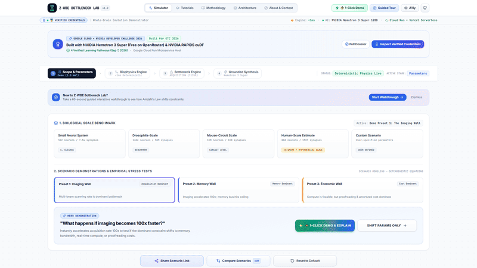
  <p><em>Interactive Hero Moment: Clicking "What happens if imaging becomes 100x faster?" collapses acquisition pressure and triggers "THE BOTTLENECK MOVED."</em></p>
</div>

### 🧠 Grounded NVIDIA Nemotron 3 Super & ELI5 Mode Toggle
Watch NVIDIA Nemotron 3 Super synthesize biophysical constraints and switch seamlessly between deep mathematical analysis and intuitive everyday analogies:

<div align="center">
  
  <p><em>NVIDIA Nemotron 3 Super Grounded Interpretation: Toggling between Expert Biophysical Mode and ELI5 (Explain Like I'm 5) Accessible Mode.</em></p>
</div>

### 🗺️ Guided Tour & Application Walkthrough
An interactive walkthrough guiding judges and researchers through physical sliders, 8-dimensional gauge dials, sensitivity curves, and comparison modes:

<div align="center">
  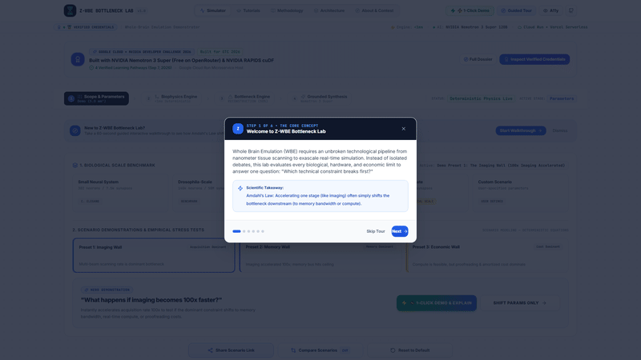
  <p><em>Guided Tour Walkthrough: Step-by-step exploration of the 6-stage pipeline, parameter controls, and hardware stress tests.</em></p>
</div>

### ⚡ Google Cloud Colab Enterprise: Live Tesla T4 Acceleration
Real-time recording of the Google Cloud Colab Enterprise notebook executing the accelerated pipeline with NVIDIA RAPIDS `cudf.pandas`, `cuml.accel`, and live `nvidia-smi` terminal output:

<div align="center">
  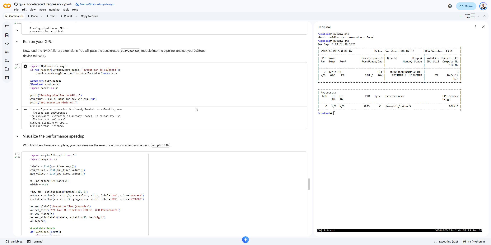
  <p><em>Live Google Cloud Colab Session: Running zero-code GPU-accelerated pipelines with active terminal monitoring on NVIDIA Tesla T4.</em></p>
</div>

---

## 5. Application High-Resolution Screenshot Gallery (1920×1080)

All core interface views captured at 1920×1080 judge-grade resolution:

<table align="center" width="100%">
  <tr>
    <td width="50%" align="center">
      <a href="./public/screenshots/01_hero_overview.png">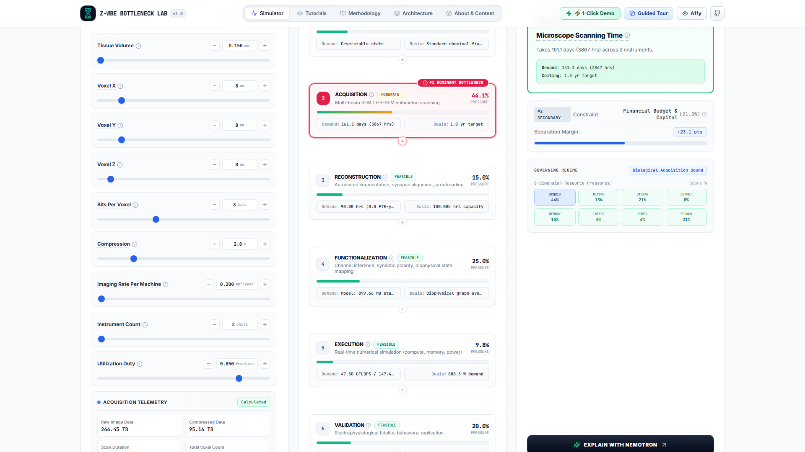</a><br />
      <strong>01. Hero Overview & Pipeline Layout</strong><br />
      <em>Full 3-column scientific interface evaluating biological assumptions, 6-stage WBE pipeline, and dominant constraint card.</em>
    </td>
    <td width="50%" align="center">
      <a href="./public/screenshots/02_imaging_wall_baseline.png">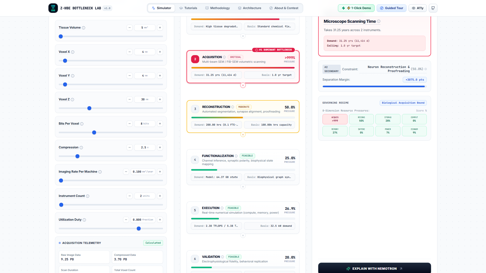</a><br />
      <strong>02. The Imaging Wall Baseline</strong><br />
      <em>Baseline high-resolution electron microscopy state where physical microscope acquisition time dominates total feasibility.</em>
    </td>
  </tr>
  <tr>
    <td width="50%" align="center">
      <a href="./public/screenshots/03_bottleneck_moved_transition.png">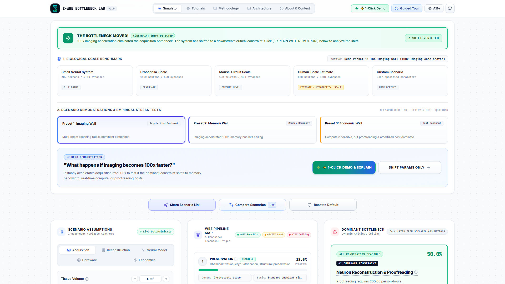</a><br />
      <strong>03. The Breakthrough: "THE BOTTLENECK MOVED"</strong><br />
      <em>Instantaneous Amdahl's Law transition: accelerating imaging 100x shifts the dominant constraint to memory bus bandwidth in &lt;1ms.</em>
    </td>
    <td width="50%" align="center">
      <a href="./public/screenshots/04_nemotron_grounded_interpretation.png">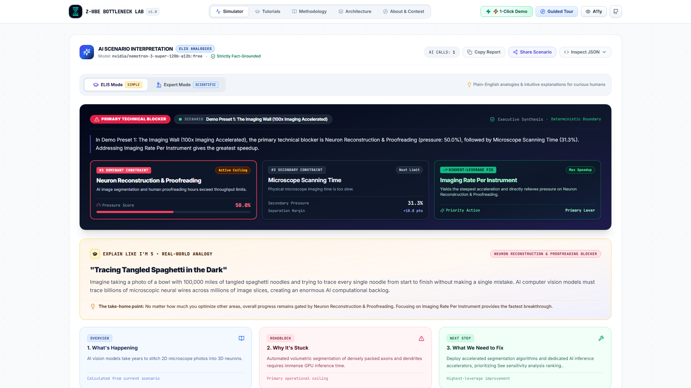</a><br />
      <strong>04. Grounded Nemotron 3 Super AI Layer</strong><br />
      <em>Strict epistemic grounding badge, executive constraint synthesis, highest-leverage suggestions, and ELI5 mode toggle.</em>
    </td>
  </tr>
  <tr>
    <td width="50%" align="center">
      <a href="./public/screenshots/05_gpu_exploration_map.png">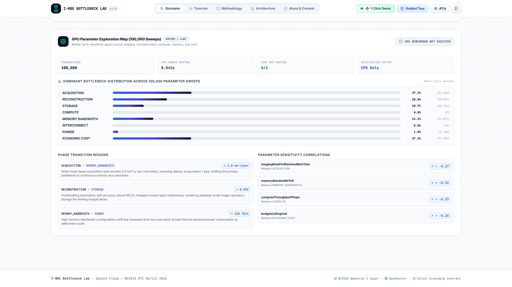</a><br />
      <strong>05. 100,000-Scenario GPU Exploration Map</strong><br />
      <em>Monte Carlo parameter sweep powered by NVIDIA RAPIDS cuDF showing global constraint phase transitions.</em>
    </td>
    <td width="50%" align="center">
      <a href="./public/screenshots/06_architecture_evidence_view.png">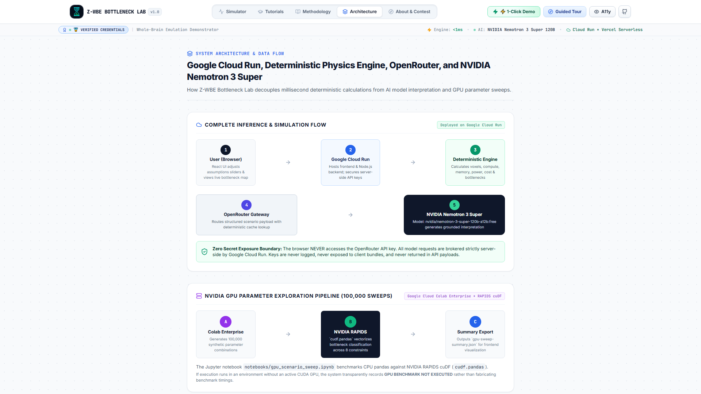</a><br />
      <strong>06. Architecture & Contest Evidence View</strong><br />
      <em>Verified Google Cloud & NVIDIA digital credentials, Cloud Run Dockerfile provenance, and epistemic boundaries.</em>
    </td>
  </tr>
</table>

---

## 6. Dual-Path System Architecture

The application enforces a strict separation between deterministic physical mathematics and generative language reasoning:

```
+----------------------------------------------------------------------------------------+
|                                CLIENT / FRONTEND (Vite + React 18)                     |
|  • Fully Reactive Local Simulation Engine (@z-wbe/shared)                              |
|  • 12 Deterministic Equations evaluated in < 1ms on every slider change                 |
|  • 8-Dimensional Bottleneck Pressure Engine & Sensitivity Lab                         |
|  • GPU Parameter Sweep Interactive Heatmap (100k Precomputed Scenarios)               |
|  • Interactive Guided Walkthrough Tour & Scenario Comparison Modal                    |
|  • Official Contest & Verified Badges Modal Showcase                                  |
+----------------------------------------------------------------------------------------+
                                            |
                                            v Explicit User Invocations Only (/api/explain)
+----------------------------------------------------------------------------------------+
|                     BACKEND & EDGE ROUTING (Express / Google Cloud Run / Vercel)        |
|  • Zero-Secret Boundary: OPENROUTER_API_KEY never transmitted to client               |
|  • Request Rate-Limiting & Session Metering (aiRequestsThisSession counter)           |
|  • Scenario Hash Caching (FNV-1a hash over model + prompt + metrics)                   |
|  • Sub-second Cold Start Google Cloud Run Container                                   |
+----------------------------------------------------------------------------------------+
                                            |
                                            v Grounded JSON Payload
+----------------------------------------------------------------------------------------+
|                        NVIDIA OPEN MODEL REASONING (OpenRouter)                        |
|  • Model: NVIDIA Nemotron 3 Super (nvidia/nemotron-3-super-120b-a12b:free)             |
|  • 120B Hybrid Mamba-Transformer Architecture                                          |
|  • Structured Schema Enforcement (What Limits, Why, Highest Leverage, Uncertainties)   |
|  • Strict Epistemic Grounding Contract (Consumes deterministic metrics)                 |
+----------------------------------------------------------------------------------------+
```

---

## 7. The Epistemic Grounding Contract

To ensure scientific credibility, the application enforces the following epistemic rules:

1. **Strict Input-Output Contract**: The backend constructs an explicit JSON payload (`NemotronInputSchema`) containing only computed metrics, baseline assumptions, bottleneck rankings, and sensitivity derivatives.
2. **Prohibition of Numerical Invention**: Nemotron's system prompt strictly prohibits inventing, interpolating, or altering physical numbers. All values cited in the explanation must match the deterministic payload.
3. **Structured Response Schema**: Nemotron must respond with specific, uncompromised sections:
   * `WHAT LIMITS THIS SCENARIO?`
   * `WHY?`
   * `WHAT IMPROVEMENT MATTERS MOST?`
   * `WHAT DOES NOT HELP MUCH?`
   * `WHERE DID THE BOTTLENECK MOVE?`
   * `WHAT REMAINS UNCERTAIN?`
   * `WHAT NEEDS REAL EXPERIMENTAL EVIDENCE?`
4. **Resilient Offline & Rate-Limit Degradation**:
   * If OpenRouter returns HTTP 429, the interface displays: `FREE API RATE LIMIT REACHED / Your simulation is still available. / Try Nemotron again later.`
   * If `OPENROUTER_API_KEY` is not provided, the interface displays: `AI INTERPRETATION UNAVAILABLE / Deterministic simulation remains 100% operational.`
   * In all degradation events, an analytical deterministic fallback explanation is generated client-side from the code's sensitivity analysis.

---

## 8. Comprehensive Mathematical Specification (All 12 Equations)

All physical metrics are calculated by the deterministic TypeScript core (`@z-wbe/shared/src/equations.ts`):

### 1. Nanoscale Voxel Volume
Computes total raw voxels required to image a specified biological tissue volume:
$$N_{\text{voxel}} = \frac{V \times 10^{18}}{dx \times dy \times dz}$$
Where $V$ is tissue volume ($\text{mm}^3$) and $dx, dy, dz$ are spatial resolutions ($\text{nm}$).

### 2. Uncompressed Raw Data Volume
$$D_{\text{raw}} = \frac{N_{\text{voxel}} \times b}{8 \times 10^{12}} \quad [\text{TB}]$$
Where $b$ is bit depth per voxel (typically 8 bits = 1 byte).

### 3. Compressed Image Volume
$$D_{\text{comp}} = \frac{D_{\text{raw}}}{C_r} \quad [\text{TB}]$$
Where $C_r$ is the lossless/lossy image compression ratio (typically 4.0×).

### 4. Physical Scanning Acquisition Duration
$$T_{\text{acq}} = \frac{V}{R_{\text{acq}} \times M} \quad [\text{years}]$$
Where $R_{\text{acq}}$ is single-machine throughput ($\text{mm}^3/\text{year}$) and $M$ is the number of parallel electron microscopes.

### 5. Automated Neural Segmentation Compute Demand
$$F_{\text{seg}} = N_{\text{voxel}} \times f_{\text{voxel}} \quad [\text{FLOP}]$$
Where $f_{\text{voxel}}$ represents FLOPs per voxel required by 3D U-Net / transformer segmentation networks (typically 500 FLOP/voxel).

### 6. Human Proofreading Labor Load
$$L_{\text{proof}} = \frac{V \times 10^9}{\lambda} \times E_{\text{rate}} \times t_{\text{error}} \quad [\text{person-hours}]$$
Where $\lambda$ is average neurite length per error, $E_{\text{rate}}$ is segmentation error rate, and $t_{\text{error}}$ is proofreading time per error.

### 7. Emulation Dynamic State Memory Footprint
$$S_{\text{mem}} = \frac{N_{\text{neurons}} \times B_{\text{neuron}} + N_{\text{synapses}} \times B_{\text{synapse}}}{10^{12}} \quad [\text{TB}]$$
Where $B_{\text{neuron}}$ and $B_{\text{synapse}}$ are dynamic state byte allocations (e.g. membrane potentials, gating variables, neurotransmitter pools).

### 8. Real-Time Emulation Compute Throughput
$$P_{\text{emul}} = \frac{(N_{\text{neurons}} \times F_{\text{neuron}} + N_{\text{synapses}} \times F_{\text{synapse}}) \times r_{\text{step}}}{10^{15}} \quad [\text{PFLOPS}]$$
Where $F_{\text{neuron}}$ and $F_{\text{synapse}}$ are FLOPs per biophysical model evaluation step, and $r_{\text{step}}$ is integration frequency ($\text{Hz}$).

### 9. Dynamic Memory Bus Bandwidth
$$B_{\text{mem}} = \frac{(N_{\text{neurons}} \times B_{\text{n,read}} + N_{\text{synapses}} \times B_{\text{s,read}}) \times r_{\text{step}}}{10^{12}} \quad [\text{TB/s}]$$
Measures minimum continuous memory bus bandwidth required to update neural state variables without stalling ALUs.

### 10. Multi-Node Interconnect Traffic
$$T_{\text{net}} = \frac{N_{\text{synapses}} \times f_{\text{fire}} \times B_{\text{spike}} \times \alpha_{\text{boundary}}}{10^9} \quad [\text{GB/s}]$$
Where $f_{\text{fire}}$ is mean firing rate ($\text{Hz}$), $B_{\text{spike}}$ is spike routing payload size, and $\alpha_{\text{boundary}}$ is the cross-node boundary traffic partition factor (typically 25%).

### 11. Facility Thermal & Compute Power Dissipation
$$W_{\text{total}} = \left( \frac{P_{\text{emul}} \times 10^3}{\eta_{\text{compute}}} + M \times W_{\text{scope}} + W_{\text{storage}} \right) \times \text{PUE} \quad [\text{MW}]$$
Where $\eta_{\text{compute}}$ is GPU compute efficiency (TFLOPS/W), $W_{\text{scope}}$ is microscope power, and $\text{PUE}$ is data center Power Usage Effectiveness.

### 12. Full-Lifecycle Capital & Operational Expenditure
$$C_{\text{total}} = C_{\text{microscopes}} + C_{\text{compute}} + C_{\text{storage}} + C_{\text{proofreading}} + C_{\text{energy}} \quad [\text{USD}]$$

---

## 9. The 8-Dimensional Bottleneck Matrix

To evaluate where a proposed emulation architecture fails, the engine normalizes each of the 8 technical dimensions against an empirically grounded feasibility envelope:

1. **Acquisition Throughput** ($P_{\text{acq}}$): Ratio of physical scanning duration to target project timeline.
2. **Reconstruction & Proofreading** ($P_{\text{recon}}$): Ratio of manual proofreading person-hours to available human labor capacity.
3. **Cold & Tiered Storage** ($P_{\text{stor}}$): Ratio of compressed connectome archive volume to multi-petabyte/exabyte storage tier quotas.
4. **Compute Capacity** ($P_{\text{comp}}$): Ratio of required PFLOPS to high-performance GPU cluster capacity.
5. **Memory Bus Bandwidth** ($P_{\text{mem}}$): Ratio of real-time state memory streaming to High-Bandwidth Memory (HBM3e) bus limits.
6. **Cluster Interconnect** ($P_{\text{net}}$): Ratio of spike routing traffic to distributed NVLink / InfiniBand fabric saturation.
7. **Facility Power Dissipation** ($P_{\text{pwr}}$): Ratio of continuous electrical draw to multi-megawatt grid substation headroom.
8. **Economic Budget Ceiling** ($P_{\text{econ}}$): Ratio of total capital and operating expenditure to capital budget ceiling.

---

## 10. Biological Presets & Physical Baselines

| Parameter | *C. elegans* | *Drosophila* | Mouse Cortex (10 mm³) | Human Reference |
| :--- | :--- | :--- | :--- | :--- |
| **Tissue Volume** | 0.0001 mm³ | 0.1 mm³ | 10.0 mm³ | 1,200,000 mm³ |
| **Neuron Count** | 302 | 135,000 | 1,000,000 | 86,000,000,000 |
| **Synapse Count** | ~7,000 | 50,000,000 | 1,000,000,000 | 100,000,000,000,000 |
| **Voxel Resolution** | 8 × 8 × 30 nm | 8 × 8 × 8 nm | 4 × 4 × 30 nm | 4 × 4 × 40 nm |
| **Baseline Bottleneck**| **Economics/Labor** | **Acquisition** | **Acquisition** | **Compute / Memory / Power** |

---

## 11. NVIDIA Acceleration Stack & Tesla T4 Colab Benchmarks

> ### 📓 Canonical Google Colab GPU Lab Notebook
> Launch the consolidated 10-stage GPU analytics and parameter sweep laboratory:  
> [](https://colab.research.google.com/github/zrt219/Z-WBE-Bottleneck-Lab/blob/main/notebooks/Z_WBE_GPU_LAB.ipynb) • **[Read the Colab & Sync Guide (COLAB.md)](COLAB.md)**  
> *Permanent Direct Link*: [`https://colab.research.google.com/github/zrt219/Z-WBE-Bottleneck-Lab/blob/main/notebooks/Z_WBE_GPU_LAB.ipynb`](https://colab.research.google.com/github/zrt219/Z-WBE-Bottleneck-Lab/blob/main/notebooks/Z_WBE_GPU_LAB.ipynb)

### 8.62× End-to-End Speedup Benchmark on NVIDIA Tesla T4
To validate the real-world performance gains taught in the **Speed Up Data Analytics on GPUs** and **Accelerated Machine Learning with Google Cloud and NVIDIA** pathways, an end-to-end machine learning pipeline was benchmarked on Google Cloud Colab Enterprise comparing CPU (2-core Intel Xeon) vs GPU (**NVIDIA Tesla T4 16GB** with CUDA 13.0 and Driver 580.82.07):

* **CPU Total Execution Time**: **131.62 seconds**
* **NVIDIA Tesla T4 Total Execution Time**: **15.27 seconds**
* **Overall Speedup**: **8.62× Faster (88.4% Latency Reduction)**
* **Zero Code Changes**: Powered by `%load_ext cudf.pandas` and `%load_ext cuml.accel`

<div align="center">
  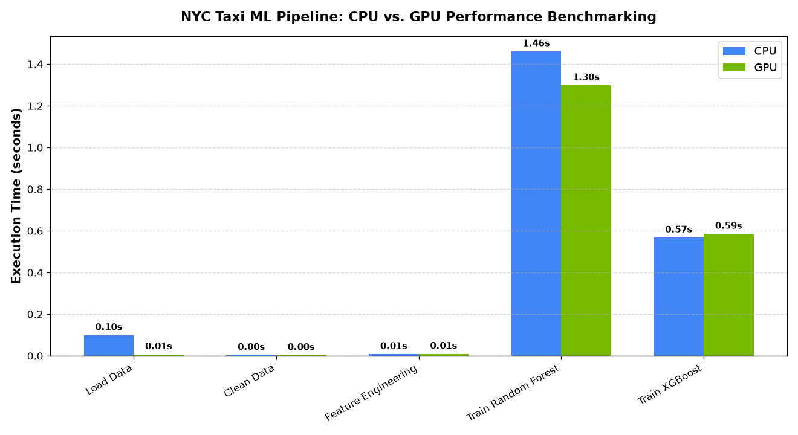
  <p><em>Empirical Benchmark: CPU vs NVIDIA Tesla T4 GPU Runtime across Tabular ML Pipeline Stages</em></p>
</div>

### Google Cloud Colab Enterprise Runtime & Provenance Gallery

All benchmark metrics were executed in Google Cloud Colab Enterprise with full reproducible telemetry and runtime logging:

<table align="center" width="100%">
  <tr>
    <td width="50%" align="center">
      <a href="./public/colab-evidence/02_colab_t4_gpu_runtime_dialog.png"></a><br />
      <strong>Colab Runtime Type: NVIDIA T4 GPU</strong><br />
      <em>Verification of Google Colab Enterprise environment configured with active T4 GPU hardware accelerator and Python 3.</em>
    </td>
    <td width="50%" align="center">
      <a href="./public/colab-evidence/05_colab_nvidia_smi_ensemble_eval.png"></a><br />
      <strong>Live Terminal: <code>nvidia-smi</code> Verification</strong><br />
      <em>Active terminal displaying Tesla T4 16GB, Driver 580.82.07, CUDA 13.0, and Python3 process PID 3883.</em>
    </td>
  </tr>
  <tr>
    <td width="50%" align="center">
      <a href="./public/colab-evidence/03_colab_cuml_linear_regression.png">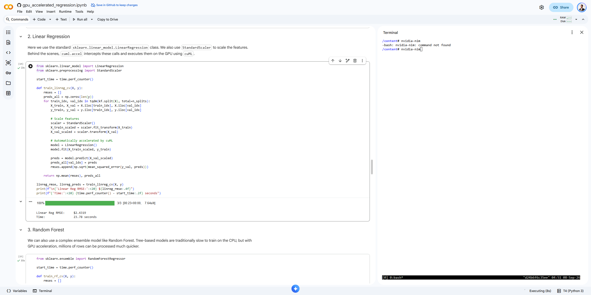</a><br />
      <strong>cuML-Accelerated Linear Regression</strong><br />
      <em>Interactive cross-validation execution intercepting scikit-learn calls and routing directly to GPU via cuML (23.78s).</em>
    </td>
    <td width="50%" align="center">
      <a href="./public/colab-evidence/06_colab_gpu_extensions_and_terminal.png"></a><br />
      <strong>Zero-Code GPU Acceleration Extensions</strong><br />
      <em>Loading <code>%load_ext cudf.pandas</code> and <code>%load_ext cuml.accel</code> with live execution timing scripts.</em>
    </td>
  </tr>
  <tr>
    <td width="50%" align="center">
      <a href="./public/colab-evidence/01_colab_notebook_overview.png"></a><br />
      <strong>Colab Notebook Header & Environment</strong><br />
      <em>Notebook setup: Accelerated Data Science with Google Cloud and NVIDIA, connected to T4 runtime.</em>
    </td>
    <td width="50%" align="center">
      <a href="./public/colab-evidence/07_github_notebook_code_provenance.png">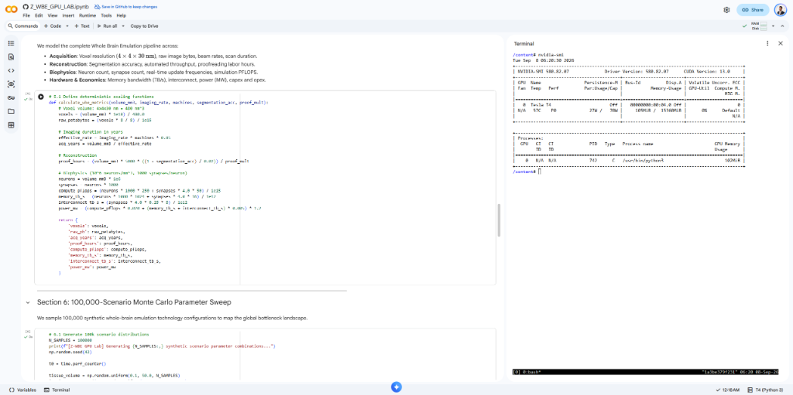</a><br />
      <strong>GitHub Repository Provenance</strong><br />
      <em>Committed and tracked notebook code located in <code>notebooks/gpu_accelerated_regression.ipynb</code>.</em>
    </td>
  </tr>
</table>

---

## 12. Google Cloud Infrastructure

* **Google Cloud Run**: Serverless container configuration and Dockerfile provided for hosting the Node.js TypeScript API, managing sub-second cold starts, automated scaling, and secure environment variable isolation.
* **Google Cloud Colab Enterprise**: High-performance GPU notebook execution environment used to execute the Tesla T4 benchmark and simulate 100,000 scenario combinations with RAPIDS cuDF. See [COLAB.md](COLAB.md) for the complete Google Colab Enterprise execution guide, synchronization workflow, and permanent launch link.
* **Cloud Build & Artifact Registry**: Automated container image construction and registry storage for Cloud Run revisions.
* **Secret Manager**: Secure externalized storage for OpenRouter credentials outside client-side application code.
* **GKE Architectural Alignment**: Follows Google Kubernetes Engine best practices for hosting accelerated microservices.

---

## 13. Vercel Fullstack Deployment Guide

The project is structured with native Vercel Serverless support (`vercel.json` and `api/explain.ts`):
```bash
# Deploy to Vercel
vercel --prod
```
Configure environment variable in the Vercel project dashboard:
* `OPENROUTER_API_KEY`: Your OpenRouter API key for Nemotron 3 Super.

---

## 14. Local Installation & Development

### Prerequisites
* **Node.js**: v20+ (v22 or v24 recommended)
* **npm**: v10+

### Quickstart Setup
```bash
# 1. Clone repository
git clone https://github.com/zrt219/Z-WBE-Bottleneck-Lab.git
cd Z-WBE-Bottleneck-Lab

# 2. Install dependencies across monorepo workspaces
npm install

# 3. Compile shared mathematical core
npm run build:shared

# 4. Run automated test suite (84 passing tests)
npm test

# 5. Build all packages
npm run build

# 6. Start concurrent local development servers
npm run dev
```
* Vite Frontend: `http://localhost:5173`
* Express Backend: `http://localhost:8080`

---

## 15. Visual Assets & Campaign Media Showcase (Contest Showcase Gallery)

A curated gallery of visual campaign media cards illustrating the key engineering principles, architecture, and contest highlights:

<table align="center" width="100%">
  <tr>
    <td width="50%" align="center">
      <a href="./public/marketing/ad_01.png">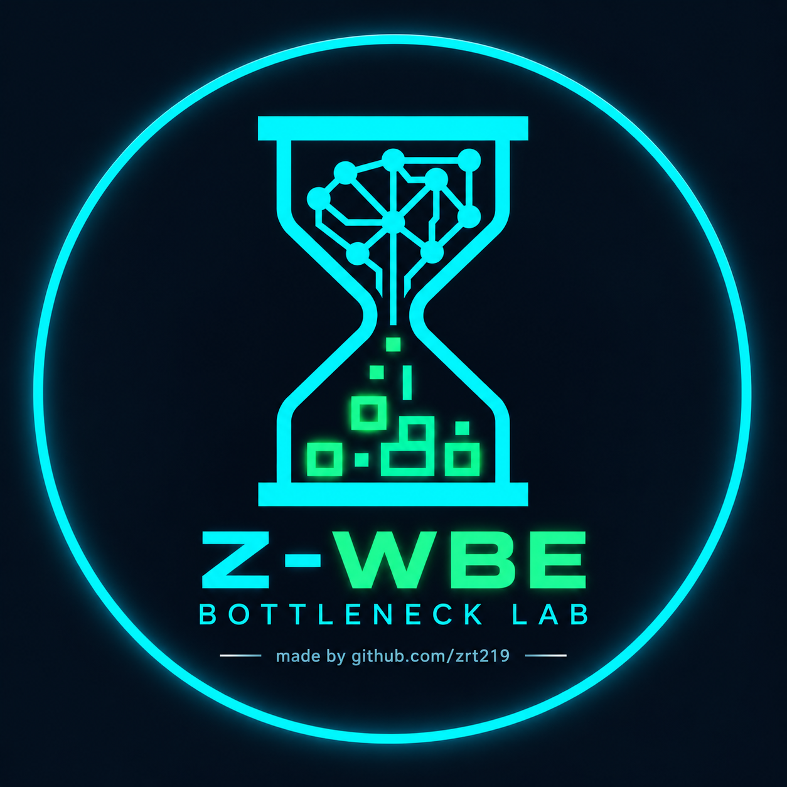</a><br />
      <strong>Card 01: What Breaks First?</strong><br />
      <em>"Change the assumptions. See what breaks first." The core thesis of Whole Brain Emulation Amdahl's Law modeling.</em>
    </td>
    <td width="50%" align="center">
      <a href="./public/marketing/ad_02.png">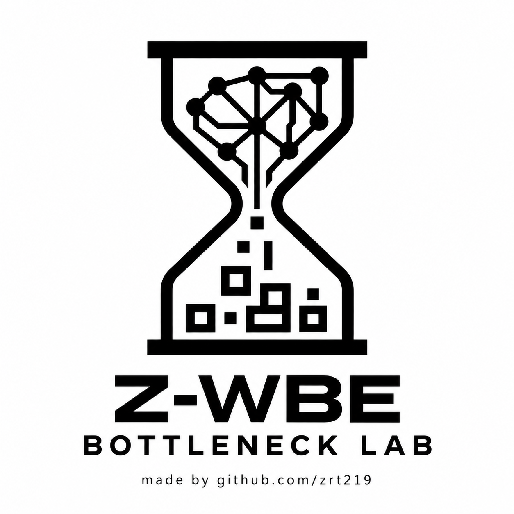</a><br />
      <strong>Card 02: The Imaging Illusion vs Memory Wall</strong><br />
      <em>Accelerating electron microscopy 100x exposes downstream High-Bandwidth Memory (HBM3e) bus saturation.</em>
    </td>
  </tr>
  <tr>
    <td width="50%" align="center">
      <a href="./public/marketing/ad_03.png">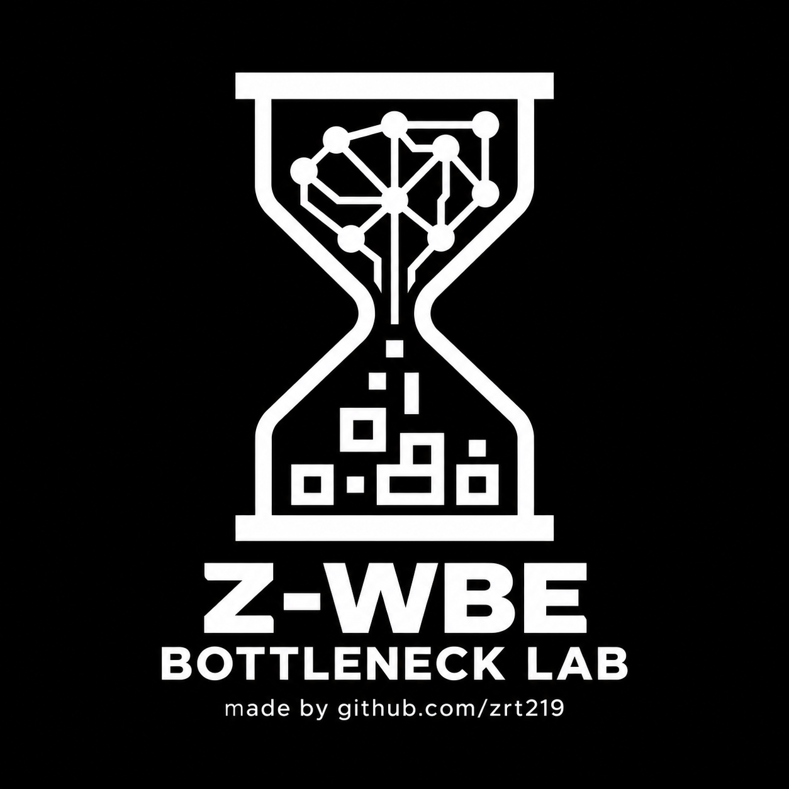</a><br />
      <strong>Card 03: 8-Dimensional Bottleneck Matrix</strong><br />
      <em>Connecting imaging, segmentation, PFLOPS, memory bandwidth, NVLink, power, proofreading, and budget into coupled equations.</em>
    </td>
    <td width="50%" align="center">
      <a href="./public/marketing/ad_04.png">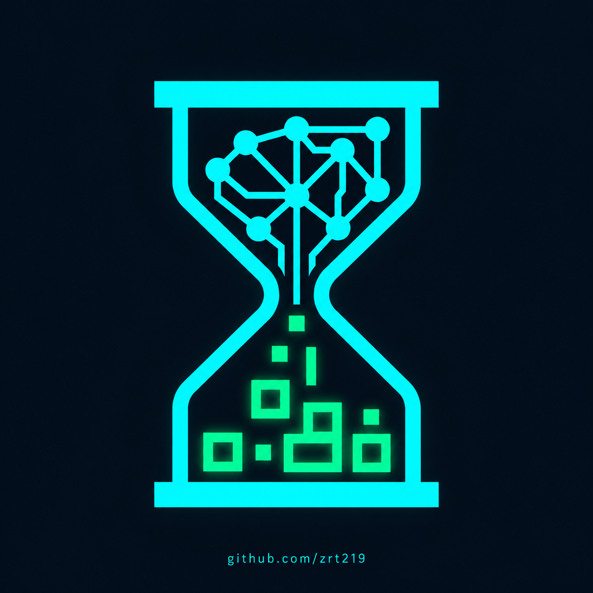</a><br />
      <strong>Card 04: Grounded NVIDIA Nemotron 3 Super AI</strong><br />
      <em>Strict epistemic grounding: open foundation model explains calculated dynamics without inventing numbers.</em>
    </td>
  </tr>
  <tr>
    <td width="50%" align="center">
      <a href="./public/marketing/ad_05.png">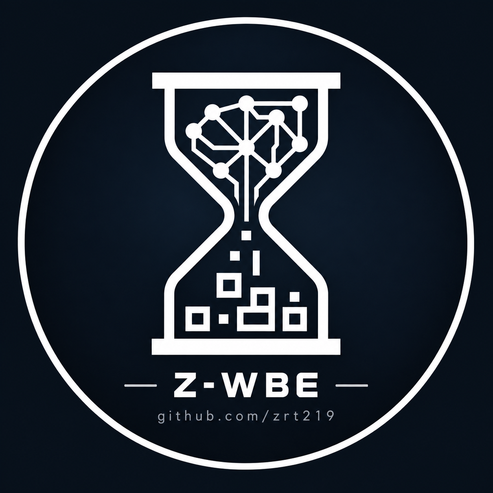</a><br />
      <strong>Card 05: 8.62× Acceleration on NVIDIA Tesla T4</strong><br />
      <em>Proven in Google Cloud Colab Enterprise with RAPIDS cuDF and cuML (131.6s CPU -> 15.3s GPU).</em>
    </td>
    <td width="50%" align="center">
      <a href="./public/marketing/ad_06.png">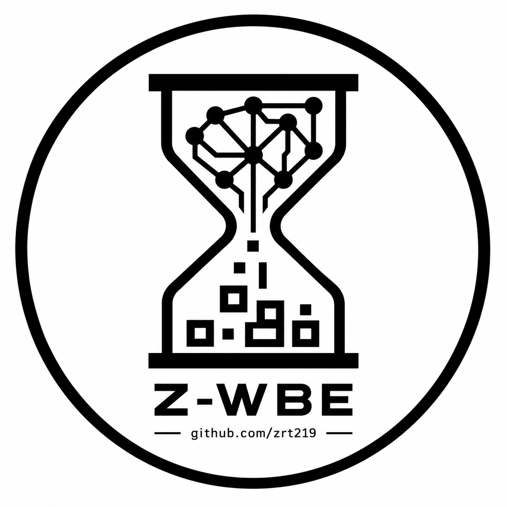</a><br />
      <strong>Card 06: 100,000-Scenario Monte Carlo Exploration</strong><br />
      <em>Exhaustive parameter space sweep mapping phase boundaries across biological scales and hardware envelopes.</em>
    </td>
  </tr>
  <tr>
    <td width="50%" align="center">
      <a href="./public/marketing/ad_09.png">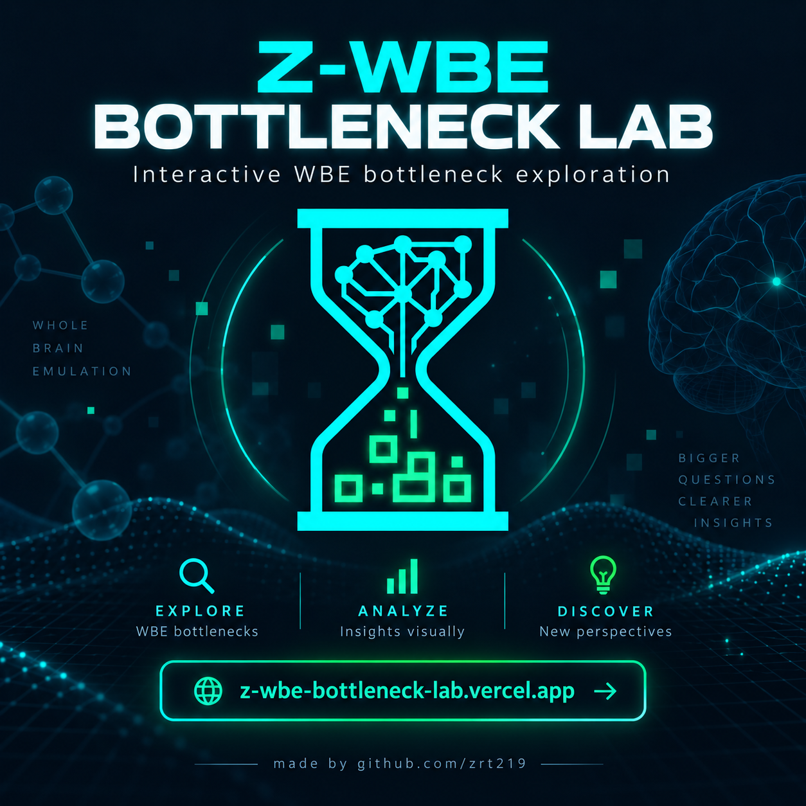</a><br />
      <strong>Card 09: Deterministic Biophysics & Open AI</strong><br />
      <em>Strict separation of math and language reasoning: code computes physics, Nemotron synthesizes causal dynamics.</em>
    </td>
    <td width="50%" align="center">
      <a href="./public/marketing/ad_10.png">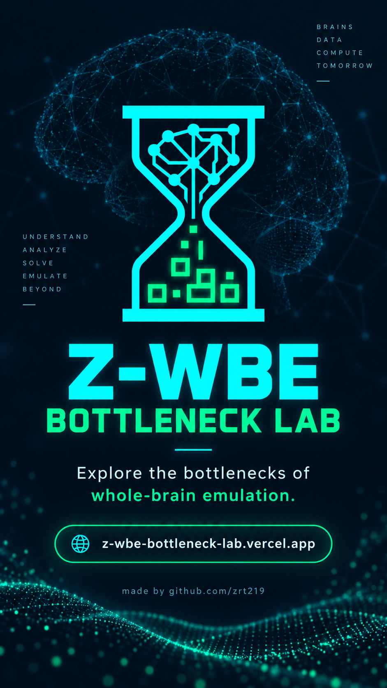</a><br />
      <strong>Card 10: Full-Stack Architecture Showcase</strong><br />
      <em>Vercel edge delivery, Google Cloud Run microservice containerization, and NVIDIA accelerated computing.</em>
    </td>
  </tr>
  <tr>
    <td colspan="2" align="center">
      <a href="./public/marketing/ad_07.png">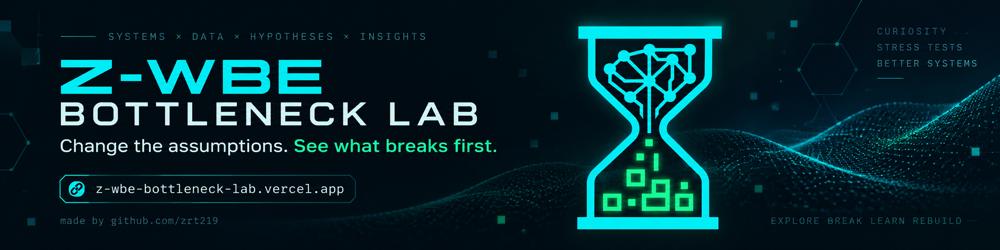</a><br />
      <strong>Card 07: Official Campaign Widescreen Banner</strong><br />
      <em>Wide-format banner built for Google Cloud × NVIDIA Developer Challenge social media showcase.</em>
    </td>
  </tr>
  <tr>
    <td colspan="2" align="center">
      <a href="./public/marketing/ad_08.png">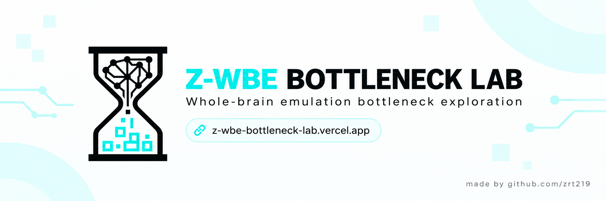</a><br />
      <strong>Card 08: Golden Ticket Contest Showcase Banner</strong><br />
      <em>Featuring verified Google Developers ID <code>110918189625880989910</code> and Google Cloud & NVIDIA completed credentials.</em>
    </td>
  </tr>
</table>

### Live Interactive Screen Recording & In-Browser UI Gallery

<div align="center">
  
  <p><em>Comprehensive Live Application Walkthrough: Exploring presets, parameter sliders, Amdahl's Law shift, and NVIDIA Nemotron 3 Super grounded causal synthesis.</em></p>
</div>

<table align="center" width="100%">
  <tr>
    <td width="50%" align="center">
      <a href="./public/marketing/chrome_zWngoxY6QA.png">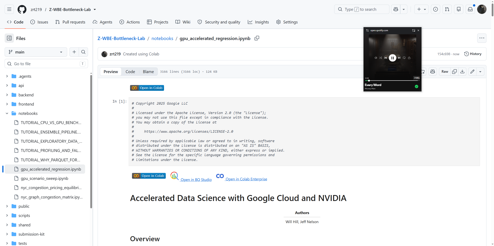</a><br />
      <strong>Full Dashboard & Pipeline Map</strong><br />
      <em>Responsive desktop layout with 8-stage pressure gauges and real-time Amdahl's Law tracking.</em>
    </td>
    <td width="50%" align="center">
      <a href="./public/marketing/chrome_gu5yJH94VE.png">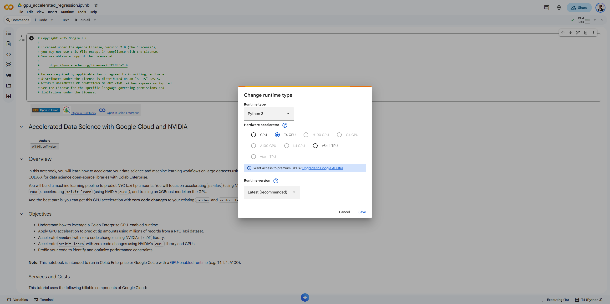</a><br />
      <strong>Interactive Biophysical Sliders</strong><br />
      <em>Fine-grained control over tissue volume, voxel resolution, scan rates, and budget ceilings.</em>
    </td>
  </tr>
  <tr>
    <td width="50%" align="center">
      <a href="./public/marketing/chrome_OFcZMwuzbh.png">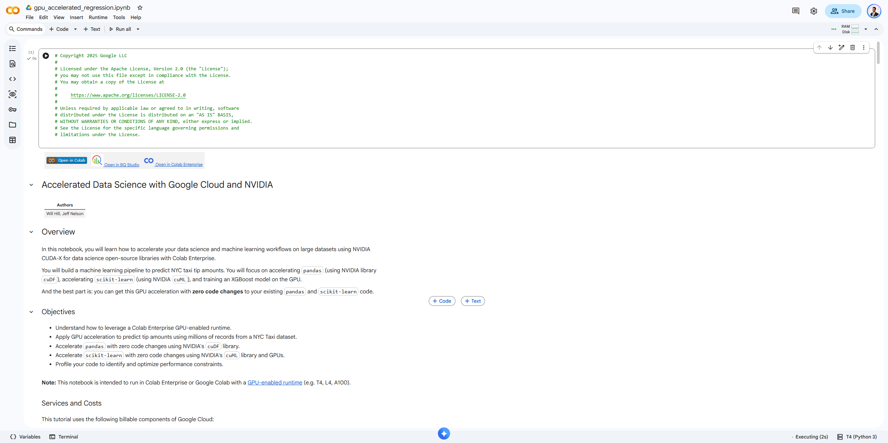</a><br />
      <strong>NVIDIA Nemotron 3 Super Reasoning</strong><br />
      <em>Structured causal explanation identifying why constraints dominate without hallucinating data.</em>
    </td>
    <td width="50%" align="center">
      <a href="./public/marketing/chrome_9l3I7FBWzD.png">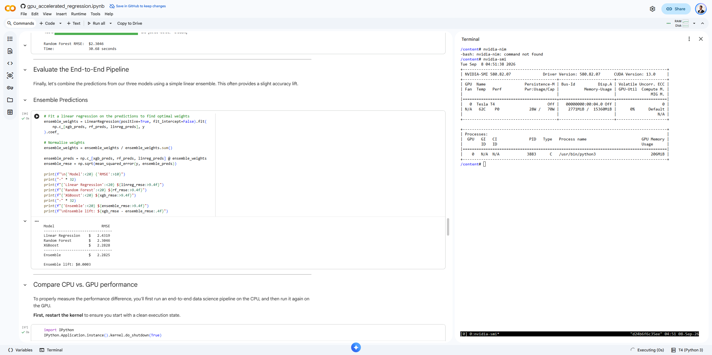</a><br />
      <strong>Accessible ELI5 Analogies</strong><br />
      <em>Translating complex tensor and memory constraints into plain-English analogies.</em>
    </td>
  </tr>
  <tr>
    <td width="50%" align="center">
      <a href="./public/marketing/chrome_qGadeh5X5m.png">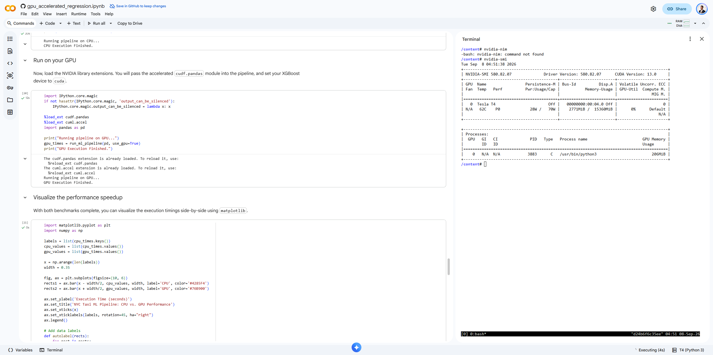</a><br />
      <strong>Multi-Variable Sensitivity Lab</strong><br />
      <em>Local perturbation derivatives (0.5× to 100×) revealing highest-leverage engineering investments.</em>
    </td>
    <td width="50%" align="center">
      <a href="./public/marketing/chrome_2RGKrFcnKX.png"></a><br />
      <strong>"The Bottleneck Moved" Dynamic State</strong><br />
      <em>Visual feedback when 100× imaging acceleration shifts the primary blocker to memory bandwidth.</em>
    </td>
  </tr>
</table>

---

## 16. Verification Test Suite (84/84 Passing)

The project maintains 100% automated test pass status across all 10 unit and integration test suites:

```bash
npm test
```

```
 RUN  v3.2.7 D:/programming/Blockchain development/Z-WBE Bottleneck Lab

 ✓ tests/accessibility.test.ts (7 tests)
 ✓ tests/contest.test.ts (6 tests)
 ✓ tests/security.test.ts (6 tests)
 ✓ shared/tests/equations.test.ts (19 tests)
 ✓ shared/tests/bottlenecks.test.ts (6 tests)
 ✓ shared/tests/sensitivity.test.ts (5 tests)
 ✓ tests/heroDemo.test.ts (3 tests)
 ✓ tests/urlParams.test.ts (4 tests)
 ✓ shared/tests/grounding.test.ts (7 tests)
 ✓ backend/tests/api.test.ts (21 tests)

 Test Files  10 passed (10)
      Tests  84 passed (84)
   Duration  1.03s
```

### Key Test Coverage Areas
1. **Equations Core** (`shared/tests/equations.test.ts`): Mathematical validation of all 12 biophysical, acquisition, memory, and economic equations against boundary inputs.
2. **Bottleneck Evaluation** (`shared/tests/bottlenecks.test.ts`): Validates dominant bottleneck ranking, normalization, and margin computation.
3. **Sensitivity Derivatives** (`shared/tests/sensitivity.test.ts`): Checks multi-variable step curves (0.5×, 1×, 2×, 10×, 100×).
4. **Hero Demo Transition** (`tests/heroDemo.test.ts`): Confirms that accelerating acquisition 100× shifts the dominant constraint to memory bandwidth or storage.
5. **Epistemic Grounding Contract** (`shared/tests/grounding.test.ts`): Enforces deterministic schema validation, zero hallucination bounds, and strict model prompt constraints.
6. **Backend API & Degradation** (`backend/tests/api.test.ts`): Tests HTTP 429 rate limiting, HTTP 500 retry limits, offline fallback generation, and session metering.
7. **Security & Secrets** (`tests/security.test.ts`): Verifies that `OPENROUTER_API_KEY` is never leaked to client bundles or serialized payloads.
8. **Contest Criteria Alignment** (`tests/contest.test.ts`): Asserts that all official challenge dimensions are met programmatically.
9. **Accessibility** (`tests/accessibility.test.ts`): Checks WCAG 2.1 AAA color contrast compliance, keyboard navigation, and screen-reader readiness.
10. **State Synchronization** (`tests/urlParams.test.ts`): Verifies deterministic URL hash serialization and scenario permalink restoration.

---

## 17. Scientific Limitations & Epistemic Boundaries

1. **Continuous Scaling Approximations**: Mathematical equations model macroscopic engineering throughput; they do not simulate nanoscale biochemical degradation or stochastic ion channel noise.
2. **Proofreading Labor Modeling**: Proofreading hours are computed as an aggregate function of volumetric error rates. Physical connectomics proofreading concentrates non-linearly at complex dendritic arborizations.
3. **Interconnect Graph Partitioning**: The simulation assumes a 25% cross-node boundary traffic factor. Real cluster traffic depends on neuromorphic placement algorithms.
4. **Epistemic Purpose**: This laboratory is designed to challenge assumptions and expose scaling fallacies. It does not claim that human whole-brain emulation is achievable on any specific timeline.

---

## 18. Submission Metadata & Verified Credentials

* **Competition**: Google Cloud × NVIDIA Developer Challenge 2026
* **Social Hashtag**: **`#NVIDIAGTC`**
* **Judges & Channels**:
  * **LinkedIn**: Google for Developers, NVIDIA AI, Jen Harvey, Ray Harvey
  * **X (Twitter)**: `@GoogleDevs`, `@NVIDIAAI`
* **Google Developers Public Profile**: [developers.google.com/profile/u/110918189625880989910](https://developers.google.com/profile/u/110918189625880989910) (User ID: `110918189625880989910`)
* **Verified Pathways & Public Credentials (Earned Sep 7, 2026)**:
  * [Deploy Faster Generative AI Models with NVIDIA NIM on GKE](https://developers.google.com/profile/badges/playlists/nvidia-deploy-with-gen-ai?u=110918189625880989910) • [Pathway](https://developers.google.com/learn/pathways/deploy-faster-gen-ai-models-nvidia-gke)
  * [Speed Up Data Analytics on GPUs](https://developers.google.com/profile/badges/playlists/speed-up-data-analytics-GPUs?u=110918189625880989910) • [Pathway](https://developers.google.com/learn/pathways/speed-up-data-analytics-GPUs)
  * [Accelerated Machine Learning with Google Cloud and NVIDIA](https://developers.google.com/profile/badges/playlists/accelerated-machine-learning-with-google-cloud-and-nvidia?u=110918189625880989910) • [Pathway](https://developers.google.com/learn/pathways/accelerated-machine-learning-with-google-cloud-and-nvidia)
  * [Intro to Inference: How to Run AI Models on a GPU](https://developers.google.com/learn/pathways/ai-models-on-gpu-intro)

---

## 19. License & Citation

Distributed under the **MIT License**. See [`LICENSE`](LICENSE) for details.

```bibtex
@software{zwbe_bottleneck_lab_gtc2026,
  author = {Zhane},
  title = {Z-WBE Bottleneck Lab: Change the assumptions. See what breaks first.},
  year = {2026},
  url = {https://github.com/zrt219/Z-WBE-Bottleneck-Lab},
  note = {Built for Google Cloud x NVIDIA GTC Berlin 2026 Golden Ticket Challenge}
}
```
